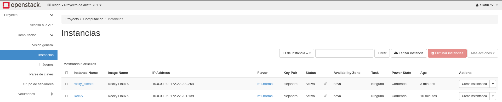

# Configuración/activación de SELinux

## Enunciado

En un servidor basado en Rocky Linux con SELinux activado en modo enforcing, asegúrate que los servicios sshfs, samba y nfs funcionan correctamente y no hay problemas de acceso con una configuración estricta y segura de SELinux. Habilita inicio de sesión de root en el acceso remoto al servidor Rocky, teniendo como nuevo puerto de acceso el no habitual en ssh. Realiza las pruebas de acceso correspondientes.

---

## Introducción

En esta práctica, trabajaremos con un servidor basado en **Rocky Linux 9** con **SELinux activado en modo enforcing** para garantizar una configuración estricta y segura. Nuestro objetivo principal es asegurar que los servicios de **SSHFS, Samba y NFS** funcionen correctamente bajo esta política de seguridad sin generar problemas de acceso.  

Adicionalmente, se habilitará el **inicio de sesión remoto para el usuario root**, pero con un enfoque seguro, cambiando el puerto por defecto del servicio **SSH** a uno no habitual. Finalmente, se realizarán pruebas de acceso para verificar la correcta configuración y seguridad del sistema.  

Las máquinas involucradas en la práctica, tanto servidor como cliente, estarán basadas en **Rocky Linux 9**.  

### Objetivos  

1. Configurar y probar el funcionamiento de **SSHFS, Samba y NFS** bajo **SELinux en modo enforcing**.  
2. Asegurar que no haya restricciones indebidas de acceso debido a SELinux.  
3. Permitir el **inicio de sesión remoto para root**, modificando el puerto por defecto de **SSH**.  
4. Realizar pruebas de acceso para verificar la correcta implementación de las configuraciones.  

---

## Implementación

Para llevar a cabo esta práctica, crearemos dos máquinas en **OpenStack** que usen distribución **Rocky Linux 9**; una de ellas actuará como **servidor** y la otra como **cliente**.



---

### SSHFS

Comenzaremos instalando `EPEL` (Extra Packages for Enterprise Linux) porque **SSHFS** no está en los repositorios base de **Rocky Linux**:

```
[rocky@rocky ~]$ sudo dnf install epel-release
```

Instalamos el paquete referente a **SSHFS**:

```
[rocky@rocky ~]$ sudo dnf install -y fuse-sshfs
```

Generamos un par de claves en nuestra máquina servidor:

```
[rocky@rocky ~]$ ssh-keygen
Generating public/private rsa key pair.
Enter file in which to save the key (/home/rocky/.ssh/id_rsa): 
Enter passphrase (empty for no passphrase): 
Enter same passphrase again: 
Your identification has been saved in /home/rocky/.ssh/id_rsa
Your public key has been saved in /home/rocky/.ssh/id_rsa.pub
The key fingerprint is:
SHA256:tL4H1MH8OeWUaBuEoMgenwQt5LX71izlu1L2oN4yODo rocky@rocky.novalocal
The key's randomart image is:
+---[RSA 3072]----+
|   .o.. .+ o.. . |
|   o.+.o  = + +  |
|    =.+ .. + B   |
|   . + +... = .  |
|    . +.S .  .   |
|       o.=+      |
|       .==+o     |
|    E o.=+...    |
|    .o oo=+.     |
+----[SHA256]-----+
```

Vamos a crear un directorio llamado `compartido` que será el que montaremos en nuestro **cliente**; le asignaremos como propietario un usuario sin privilegios y crearemos un fichero de prueba:

```
[rocky@rocky ~]$ sudo mkdir compartido                 
[rocky@rocky ~]$ sudo chown rocky:rocky compartido/
[rocky@rocky ~]$ cat compartido/prueba.txt
Prueba de funcionamiento de SSHFS
```

En la máquina que actuará como **cliente** crearemos un directorio llamado `remoto`, que será en el que montaremos el directorio del servidor:

```
alejandro@luffy:~$ mkdir remoto
```

Montamos el directorio utilizando la dirección IP del servidor y las rutas correspondientes:

```
alejandro@luffy:~$ sshfs rocky@172.22.201.139:/home/rocky/compartido ~/remoto 
```

Utilizamos el comando `df -Th` para comprobar que se ha montado correctamente:

```
alejandro@luffy:~$ df -Th
Filesystem                                  Type        Size  Used Avail Use% Mounted on
udev                                        devtmpfs    963M     0  963M   0% /dev
tmpfs                                       tmpfs       197M  592K  197M   1% /run
/dev/vda1                                   ext4         15G  5.2G  8.9G  37% /
tmpfs                                       tmpfs       984M     0  984M   0% /dev/shm
tmpfs                                       tmpfs       5.0M     0  5.0M   0% /run/lock
/dev/vda15                                  vfat        124M   12M  113M  10% /boot/efi
tmpfs                                       tmpfs       197M     0  197M   0% /run/user/1000
rocky@172.22.201.139:/home/rocky/compartido fuse.sshfs   19G  1.2G   18G   7% /home/alejandro/remoto
```

Accedemos al directorio y comprobamos que podemos ver el fichero `prueba.txt`:

```
alejandro@luffy:~$ cd remoto/
alejandro@luffy:~/remoto$ ls
prueba.txt
alejandro@luffy:~/remoto$ cat prueba.txt 
Prueba de funcionamiento de SSHFS
```

### Samba

Para comprobar que nuestra máquina servidor tiene activado **SELinux** en modo **enforcing**, usaremos el siguiente comando:

```
[rocky@rocky ~]$ sestatus
SELinux status:                 enabled
SELinuxfs mount:                /sys/fs/selinux
SELinux root directory:         /etc/selinux
Loaded policy name:             targeted
Current mode:                   enforcing
Mode from config file:          enforcing
Policy MLS status:              enabled
Policy deny_unknown status:     allowed
Memory protection checking:     actual (secure)
Max kernel policy version:      33
```

Comenzaremos instalando **samba** en nuestro sistema:

```
[rocky@rocky ~]$ sudo dnf install samba samba-common samba-client
```

Crearemos un **directorio** con el que trabajará **samba**; además crearemos un fichero llamado `prueba.txt`:

```
[rocky@rocky ~]$ sudo mkdir -p /srv/samba
[rocky@rocky ~]$ sudo touch /srv/samba/prueba.txt
```

Asignamos **permisos**, **cambiamos propietarios** y **habilitamos el uso compartido** en el directorio anterior:

```
[rocky@rocky ~]$ sudo chmod -R 755 /srv/samba/
[rocky@rocky ~]$ sudo chown -R nobody:nobody /srv/samba/
[rocky@rocky ~]$ sudo chcon -t samba_share_t /srv/samba/
```

Antes de continuar, crearemos un **fichero de respaldo** para la configuración de samba:

```
[rocky@rocky ~]$ sudo cp /etc/samba/smb.conf /etc/samba/smb.conf.bak
```

Modificamos el fichero de **configuración de samba** indicando los siguientes parámetros:

```
[rocky@rocky ~]$ cat /etc/samba/smb.conf
[global]
workgroup = WORKGROUP
server string = Samba Server %v
netbios name = rocky-9
security = user
map to guest = bad user
dns proxy = no
ntlm auth = true

[Samba]
path = /srv/samba
browsable = yes
writable = yes
guest ok = yes
read only = no

[homes]
	comment = Home Directories
	valid users = %S, %D%w%S
	browseable = No
	read only = No
	inherit acls = Yes

[printers]
	comment = All Printers
	path = /var/tmp
	printable = Yes
	create mask = 0600
	browseable = No

[print$]
	comment = Printer Drivers
	path = /var/lib/samba/drivers
	write list = @printadmin root
	force group = @printadmin
	create mask = 0664
	directory mask = 0775
```

Cabe mencionar que solo hemos cambiado las partes `[global]` y `[Samba]`, el resto las hemos dejado con la configuración por defecto.

Usaremos el siguiente comando para realizar una comprobación:

```
[rocky@rocky ~]$ sudo testparm
Load smb config files from /etc/samba/smb.conf
Loaded services file OK.
Weak crypto is allowed by GnuTLS (e.g. NTLM as a compatibility fallback)

Server role: ROLE_STANDALONE

Press enter to see a dump of your service definitions

# Global parameters
[global]
	dns proxy = No
	map to guest = Bad User
	netbios name = ROCKY-9
	ntlm auth = ntlmv1-permitted
	security = USER
	server string = Samba Server %v
	idmap config * : backend = tdb


[Samba]
	guest ok = Yes
	path = /srv/samba
	read only = No


[homes]
	browseable = No
	comment = Home Directories
	inherit acls = Yes
	read only = No
	valid users = %S %D%w%S


[printers]
	browseable = No
	comment = All Printers
	create mask = 0600
	path = /var/tmp
	printable = Yes


[print$]
	comment = Printer Drivers
	create mask = 0664
	directory mask = 0775
	force group = @printadmin
	path = /var/lib/samba/drivers
	write list = @printadmin root
```

Tras esto, **iniciaremos el servicio** de samba en nuestro servidor:

```
[rocky@rocky ~]$ sudo systemctl start smb
[rocky@rocky ~]$ sudo systemctl start nmb
[rocky@rocky ~]$ sudo systemctl enable smb
Created symlink /etc/systemd/system/multi-user.target.wants/smb.service → /usr/lib/systemd/system/smb.service.
[rocky@rocky ~]$ sudo systemctl enable nmb
Created symlink /etc/systemd/system/multi-user.target.wants/nmb.service → /usr/lib/systemd/system/nmb.service.
```

Podemos comprobar que el servicio se encuentra activo mediante el siguiente comando:

```
[rocky@rocky ~]$ sudo systemctl status smb
● smb.service - Samba SMB Daemon
     Loaded: loaded (/usr/lib/systemd/system/smb.service; enabled; preset: disabled)
     Active: active (running) since Thu 2025-02-06 10:58:53 UTC; 3min 36s ago
       Docs: man:smbd(8)
             man:samba(7)
             man:smb.conf(5)
   Main PID: 20961 (smbd)
     Status: "smbd: ready to serve connections..."
      Tasks: 3 (limit: 4450)
     Memory: 8.4M
        CPU: 97ms
     CGroup: /system.slice/smb.service
             ├─20961 /usr/sbin/smbd --foreground --no-process-group
             ├─20963 /usr/sbin/smbd --foreground --no-process-group
             └─20964 /usr/sbin/smbd --foreground --no-process-group

Feb 06 10:58:53 rocky.novalocal systemd[1]: Starting Samba SMB Daemon...
Feb 06 10:58:53 rocky.novalocal smbd[20961]: [2025/02/06 10:58:53.148680,  0] ../../source3/smbd/server.c:1746(main)
Feb 06 10:58:53 rocky.novalocal smbd[20961]:   smbd version 4.20.2 started.
Feb 06 10:58:53 rocky.novalocal smbd[20961]:   Copyright Andrew Tridgell and the Samba Team 1992-2024
Feb 06 10:58:53 rocky.novalocal systemd[1]: Started Samba SMB Daemon.
[rocky@rocky ~]$ sudo systemctl status nmb
● nmb.service - Samba NMB Daemon
     Loaded: loaded (/usr/lib/systemd/system/nmb.service; enabled; preset: disabled)
     Active: active (running) since Thu 2025-02-06 10:59:05 UTC; 3min 24s ago
       Docs: man:nmbd(8)
             man:samba(7)
             man:smb.conf(5)
   Main PID: 20969 (nmbd)
     Status: "nmbd: ready to serve connections..."
      Tasks: 1 (limit: 4450)
     Memory: 2.8M
        CPU: 70ms
     CGroup: /system.slice/nmb.service
             └─20969 /usr/sbin/nmbd --foreground --no-process-group

Feb 06 10:59:05 rocky.novalocal systemd[1]: Starting Samba NMB Daemon...
Feb 06 10:59:05 rocky.novalocal nmbd[20969]: [2025/02/06 10:59:05.957822,  0] ../../source3/nmbd/nmbd.c:901(main)
Feb 06 10:59:05 rocky.novalocal nmbd[20969]:   nmbd version 4.20.2 started.
Feb 06 10:59:05 rocky.novalocal nmbd[20969]:   Copyright Andrew Tridgell and the Samba Team 1992-2024
Feb 06 10:59:05 rocky.novalocal systemd[1]: Started Samba NMB Daemon.
```

Para permitir el **tráfico del servidor**, instalaremos la siguiente herramienta:

```
[rocky@rocky ~]$ sudo dnf install firewalld
```

Habilitamos e iniciamos `firewalld`:

```
[rocky@rocky ~]$ sudo systemctl enable firewalld
[rocky@rocky ~]$ sudo systemctl start firewalld
```

Comprobamos que funciona correctamente:

```
[rocky@rocky ~]$ sudo systemctl status firewalld
● firewalld.service - firewalld - dynamic firewall daemon
     Loaded: loaded (/usr/lib/systemd/system/firewalld.service; enabled; preset: enabled)
     Active: active (running) since Thu 2025-02-06 11:01:44 UTC; 1min 10s ago
       Docs: man:firewalld(1)
   Main PID: 21481 (firewalld)
      Tasks: 2 (limit: 4450)
     Memory: 24.7M
        CPU: 565ms
     CGroup: /system.slice/firewalld.service
             └─21481 /usr/bin/python3 -s /usr/sbin/firewalld --nofork --nopid

Feb 06 11:01:44 rocky.novalocal systemd[1]: Starting firewalld - dynamic firewall daemon...
Feb 06 11:01:44 rocky.novalocal systemd[1]: Started firewalld - dynamic firewall daemon.
```

Permitimos el **tráfico** para **samba** usando el siguiente comando:

```
[rocky@rocky ~]$ sudo firewall-cmd --permanent --add-service=samba
success
[rocky@rocky ~]$ sudo firewall-cmd --reload
success
```

Podemos comprobar los **servicios** que están **permitidos** usando la siguiente instrucción:

```
[rocky@rocky ~]$ sudo firewall-cmd --list-services
cockpit dhcpv6-client samba ssh
```

Por último, crearemos un **usuario** para **samba**, el cual añadiremos al **grupo** correspondiente:

```
[rocky@rocky ~]$ sudo useradd smbuser
[rocky@rocky ~]$ sudo smbpasswd -a smbuser
New SMB password:
Retype new SMB password:
Added user smbuser.
[rocky@rocky ~]$ sudo groupadd smb_group
[rocky@rocky ~]$ sudo usermod -g smb_group smbuser
```

Nos dirigimos al **cliente** para instalar **samba**:

```
[rocky@rocky-cliente ~]$ sudo dnf install samba-client
```

Nos conectamos al servidor indicando el **usuario** creado anteriormente y la **dirección IP** de la máquina:

```
[rocky@rocky-cliente ~]$ sudo smbclient //10.0.0.105/Samba -U smbuser
Password for [SAMBA\smbuser]:
Try "help" to get a list of possible commands.
smb: \> ls
  .                                   D        0  Thu Feb  6 11:26:37 2025
  ..                                  D        0  Thu Feb  6 11:26:37 2025
  prueba.txt                          N        0  Thu Feb  6 11:26:37 2025

		9290732 blocks of size 1024. 7891008 blocks available
smb: \>
```

Como vemos, nos hemos conectado con éxito, pudiendo acceder al fichero de prueba que creamos anteriormente.

---

### NFS

Instalamos los paquetes necesarios en nuestra máquina servidor:

```
[rocky@rocky ~]$ sudo dnf install nfs-utils
```

Iniciamos y habilitamos **nfs** con las siguientes instrucciones:

```
[rocky@rocky ~]$ sudo systemctl start nfs-server.service
[rocky@rocky ~]$ sudo systemctl enable nfs-server.service
Created symlink /etc/systemd/system/multi-user.target.wants/nfs-server.service → /usr/lib/systemd/system/nfs-server.service.
```

Crearemos un **directorio** que será el que **compartiremos** con el **cliente**:

```
[rocky@rocky ~]$ sudo mkdir /mnt/nfs
```

Nos dirigimos al directorio `/etc/exports` para indicar la **dirección IP del cliente**, el **directorio** que vamos a compartir y los **permisos** que queramos:

```
[rocky@rocky ~]$ cat /etc/exports
/mnt/nfs 10.0.0.130(rw,sync)
```

Exportamos los ficheros creados con el siguiente comando:

```
[rocky@rocky ~]$ sudo exportfs -arv
exporting 10.0.0.130:/mnt/nfs
[rocky@rocky ~]$ sudo exportfs -s
/mnt/nfs  10.0.0.130(sync,wdelay,hide,no_subtree_check,sec=sys,rw,secure,root_squash,no_all_squash)
```

Añadimos los servicios de **nfs** a **firewalld**:

```
[rocky@rocky ~]$ sudo firewall-cmd --permanent --add-service=nfs
success
[rocky@rocky ~]$ sudo firewall-cmd --permanent --add-service=rpc-bind
success
[rocky@rocky ~]$ sudo firewall-cmd --permanent --add-service=mountd
success
[rocky@rocky ~]$ sudo firewall-cmd --reload
success
```

Para que el directorio se exporte con éxito teniendo **SELinux** activado, usaremos el siguiente comando:

```
[rocky@rocky ~]$ sudo setsebool -P nfs_export_all_rw 1
```

Nos dirigimos a la máquina **cliente** para instalar los paquetes que necesitaremos:

```
[rocky@rocky-cliente ~]$ sudo dnf install nfs-utils nfs4-acl-tools
```

Iniciamos y habilitamos el servicio de **nfs**:

```
[rocky@rocky-cliente ~]$ sudo systemctl enable nfs-client.target
[rocky@rocky-cliente ~]$ sudo systemctl start nfs-client.target
```

Montamos el directorio indicando la **dirección IP del servidor** y la **ruta** deseada:

```
[rocky@rocky-cliente ~]$ sudo mount -t nfs 10.0.0.105:/mnt/nfs /mnt/
```

Usamos el comando `df -h` para comprobar que el directorio se ha montado con éxito:

```
[rocky@rocky-cliente ~]$ df -h
Filesystem          Size  Used Avail Use% Mounted on
devtmpfs            4.0M     0  4.0M   0% /dev
tmpfs               385M     0  385M   0% /dev/shm
tmpfs               154M  532K  154M   1% /run
/dev/vda4           8.9G  1.4G  7.6G  15% /
/dev/vda3           936M  280M  657M  30% /boot
/dev/vda2           100M  7.0M   93M   8% /boot/efi
tmpfs                77M     0   77M   0% /run/user/1000
10.0.0.105:/mnt/nfs  8.9G  1.4G  7.6G  16% /mnt
```

También podemos usar la siguiente instrucción para comprobarlo:

```
[rocky@rocky-cliente ~]$ mount | grep /mnt/nfs          
10.0.0.105:/mnt/nfs on /mnt type nfs4 (rw,relatime,vers=4.2,rsize=131072,wsize=131072,namlen=255,hard,proto=tcp,timeo=600,retrans=2,sec=sys,clientaddr=10.0.0.130,local_lock=none,addr=10.0.0.105)
```

Además, probaremos a crear un fichero llamado `prueba.txt` en el **servidor**:

```
[rocky@rocky ~]$ cat /mnt/nfs/prueba.txt
Prueba de funcionamiento con NFS
```

Vemos que nos aparece al momento en nuestra máquina **cliente**:

```
[rocky@rocky-cliente ~]$ ls /mnt/
prueba.txt
[rocky@rocky-cliente ~]$ cat /mnt/prueba.txt 
Prueba de funcionamiento con NFS
```

---

### SSH

Para cambiar el **puerto** que se usa por defecto **ssh** y **habilitar el inicio de sesión** al usuario **root** del **servidor Rocky**, añadiremos las siguientes líneas en el **fichero de configuración** de ssh:

```
[rocky@rocky ~]$ sudo grep -E '^PermitRootLogin|^Port' /etc/ssh/sshd_config
PermitRootLogin yes
Port 2222
```

Permitimos el **tráfico** a través de este **nuevo puerto** con el siguiente comando:

```
[rocky@rocky ~]$ sudo firewall-cmd --permanent --add-port=2222/tcp
success
[rocky@rocky ~]$ sudo firewall-cmd --reload
success
```

Podemos comprobar que se ha añadido esta nueva regla de la siguiente manera:

```
[rocky@rocky ~]$ sudo firewall-cmd --list-ports
2222/tcp
```

Agregamos este nuevo puerto a **SELinux**:

```
[rocky@rocky ~]$ sudo semanage port -a -t ssh_port_t -p tcp 2222
```

Reiniciamos el servicio **ssh** y comprobamos su estado:

```
[rocky@rocky ~]$ sudo systemctl restart sshd
[rocky@rocky ~]$ sudo systemctl status sshd.service
● sshd.service - OpenSSH server daemon
     Loaded: loaded (/usr/lib/systemd/system/sshd.service; enabled; preset: enabled)
     Active: active (running) since Fri 2025-02-07 12:21:28 UTC; 9s ago
       Docs: man:sshd(8)
             man:sshd_config(5)
   Main PID: 14877 (sshd)
      Tasks: 1 (limit: 22949)
     Memory: 1.4M
        CPU: 22ms
     CGroup: /system.slice/sshd.service
             └─14877 "sshd: /usr/sbin/sshd -D [listener] 0 of 10-100 startups"

Feb 07 12:21:28 rocky.novalocal systemd[1]: Starting OpenSSH server daemon...
Feb 07 12:21:28 rocky.novalocal sshd[14877]: Server listening on 0.0.0.0 port 2222.
Feb 07 12:21:28 rocky.novalocal sshd[14877]: Server listening on :: port 2222.
Feb 07 12:21:28 rocky.novalocal systemd[1]: Started OpenSSH server daemon.
```

Cambiamos la **contraseña** de **root**, ya que estas vienen por defecto en **OpenStack**:

```
[rocky@rocky ~]$ sudo passwd root
Changing password for user root.
New password: 
BAD PASSWORD: The password is shorter than 8 characters
Retype new password: 
passwd: all authentication tokens updated successfully.
```

Comprobamos el acceso por **ssh** a través este **nuevo puerto** usando el usuario **root**:

```
alejandro$ ssh -vvv -p 2222 root@172.22.201.139
OpenSSH_9.2p1 Debian-2+deb12u4, OpenSSL 3.0.15 3 Sep 2024
debug1: Reading configuration data /home/alejandro/.ssh/config
debug1: Reading configuration data /etc/ssh/ssh_config
debug1: /etc/ssh/ssh_config line 19: include /etc/ssh/ssh_config.d/*.conf matched no files
debug1: /etc/ssh/ssh_config line 21: Applying options for *
debug2: resolve_canonicalize: hostname 172.22.201.139 is address
debug3: expanded UserKnownHostsFile '~/.ssh/known_hosts' -> '/home/alejandro/.ssh/known_hosts'
debug3: expanded UserKnownHostsFile '~/.ssh/known_hosts2' -> '/home/alejandro/.ssh/known_hosts2'
debug3: ssh_connect_direct: entering
debug1: Connecting to 172.22.201.139 [172.22.201.139] port 2222.
debug3: set_sock_tos: set socket 3 IP_TOS 0x10
^C
```

Nos da un fallo referente al **nuevo puerto** de ssh, ya que si comentamos esta línea en el fichero de configuración, si podremos acceder al usuario **root** a través de **ssh**:

```
alejandro$ ssh root@172.22.201.139
Activate the web console with: systemctl enable --now cockpit.socket

Last login: Fri Feb  7 12:44:30 2025 from 172.22.12.25
[root@rocky ~]# whoami
root
```