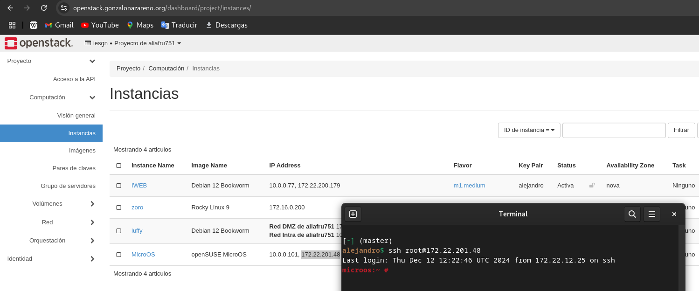

# Inmutabilidad en Sistemas Operativos

## Enunciado

Cada vez más están apareciendo sistemas operativos inmutables, ¿es una tendencia o una moda pasajera?

```
• ¿Qué es la inmutabilidad?.
    • ¿En que se fundamenta?
    • ¿A que sector va destinado? 
    • Distribuciones inmutables actuales.
    • Valoración personal al respecto.
```

Analiza las soluciones que da al sector la distribuciones basadas en el ecosistema de openSUSE y RedHat.

Instala en máquina virtual las soluciones aportadas en el punto anterior. Analiza los diferentes procedimientos de actualización del sistema, instalación de paquetería/apps propuestos por dichas distribuciones.

---

## Introducción

La inmutabilidad en sistemas operativos es una tendencia tecnológica que está ganando popularidad en el ámbito de la administración de sistemas. A diferencia de los sistemas tradicionales, los sistemas inmutables no permiten modificaciones directas en la capa base del sistema operativo. Esta característica proporciona **mayor estabilidad**, **seguridad** y facilita la gestión de actualizaciones.

En esta práctica analizaremos el concepto de inmutabilidad, las distribuciones inmutables actuales y nos centraremos en las soluciones aportadas por **openSUSE MicroOS** y **RedHat CoreOS**. Finalmente, instalaremos ambas distribuciones en máquinas virtuales para estudiar sus procedimientos de actualización e instalación de paquetería.

---

## 1. ¿Qué es la inmutabilidad?

La **inmutabilidad** en un sistema operativo hace referencia a la imposibilidad de modificar directamente el sistema base una vez desplegado. Las configuraciones y aplicaciones se gestionan de forma controlada mediante actualizaciones atómicas, **contenedores** o capas de sistema de solo lectura.

Esto garantiza:

- **Estabilidad**: Menos riesgos de errores críticos.

- **Seguridad**: Evita modificaciones maliciosas o accidentales.

- **Facilidad de administración**: Se pueden revertir cambios con facilidad.

---

## 2. ¿En qué se fundamenta?

Se basa en:

1. **Capa base de solo lectura**:
   - El sistema operativo principal está montado en una capa inmutable.
   - Solo las capas superiores (contenedores, configuraciones, etc.) permiten cambios.

2. **Gestión de actualizaciones atómicas**:
   - **Transacciones completas**: Si una actualización falla, se revierte a la versión anterior.
   - Ejemplo: Uso de **snapshots** o herramientas como **OSTree** y **btrfs**.

3. **Contenedores y modularidad**:
   - Aplicaciones y configuraciones aisladas.
   - Implementación basada en **Docker** o **Podman**.

---

## 3. ¿A qué sector va destinado?

- **Centros de datos**: Alta disponibilidad y fácil recuperación ante fallos.

- **Despliegues en la nube**: Implementación rápida y segura.

- **IoT (Internet of Things)**: Dispositivos con un sistema base inmutable y actualizable.

- **Seguridad crítica**: Servidores que requieren garantías de estabilidad.

---

## 4. Distribuciones inmutables actuales

| **Distribución**       | **Fundamento**          | **Uso principal**                |
|-------------------------|-------------------------|---------------------------------|
| **openSUSE MicroOS**    | btrfs y transacciones   | Contenedores, servidores edge    |
| **Fedora Silverblue**   | OSTree y Flatpak        | Escritorio inmutable y contenedores |
| **RHEL CoreOS**         | RPM-OSTree y Kubernetes | Servidores en clúster, OpenShift |
| **Immutable Ubuntu**    | Capa de solo lectura    | Cloud y dispositivos IoT         |

---

## 5. Valoración personal

La inmutabilidad es **más que una moda**, es una **tendencia tecnológica consolidada** debido a las siguientes ventajas:

- **Estabilidad y consistencia**: Evita la "deriva" del sistema (diferencias entre entornos).

- **Seguridad**: Minimiza puntos de ataque al sistema operativo.

- **Flexibilidad**: Facilita los despliegues de aplicaciones en contenedores.

Sin embargo, también existen algunas **desventajas**:

- **Curva de aprendizaje**: Requiere adaptarse a nuevas formas de trabajar.

- **Menor flexibilidad para personalización**: Usuarios avanzados pueden ver limitado su control sobre el sistema.

---

## 6. Soluciones de openSUSE y RedHat

### openSUSE MicroOS

- **Características**:
  - Utiliza **btrfs** para snapshots transaccionales.
  - Basado en **contenerización**.
  - Orientado a **servidores edge** y sistemas IoT.

- **Instalación**:
   - Puede ser instalado como **base inmutable**.
   - Admite **podman** y **Kubernetes** para aplicaciones en contenedores.

- **Gestión de paquetes**:
   - **zypper** para la capa mutable.
   - Actualizaciones atómicas mediante snapshots.
   - Reversiones seguras en caso de error.

---

### RedHat CoreOS

- **Características**:
  - Sistema operativo inmutable optimizado para **Kubernetes**.
  - Basado en **rpm-ostree**: combinando RPM y actualizaciones atómicas.

- **Instalación**:
   - Usada en entornos **OpenShift** y centros de datos.
   - Configuración declarativa mediante archivos YAML.

- **Gestión de paquetes**:
   - **rpm-ostree**: Las actualizaciones se aplican como **árbol de paquetes**.
   - Actualizaciones transaccionales y reversibles.
   - Compatible con **contenedores** y despliegues escalables.

---

## 7. Instalación y Procedimientos de Actualización

### Instalación en Máquina Virtual
1. **openSUSE MicroOS**:
   - Descargar la ISO de MicroOS desde [openSUSE](https://get.opensuse.org/microos).
   - Crear una máquina virtual en **VirtualBox**, **KVM** o saltarse el primer paso y usar **OpenStack**.
   - Configurar almacenamiento con **btrfs**.

2. **RHEL CoreOS**:
   - Descargar **CoreOS** desde el portal de RedHat.
   - Utilizar **Ignition** para configuración inicial (archivos JSON).
   - Instalación en modo automático con YAML declarativo.

---

### Actualización del Sistema
| **Distribución**     | **Proceso de Actualización**                               | **Reversión**            |
|-----------------------|----------------------------------------------------------|--------------------------|
| **openSUSE MicroOS**  | Snapshots transaccionales con `zypper` y `transactional-update`. | Usar `rollback` para volver a un snapshot anterior. |
| **RHEL CoreOS**       | Actualización con **rpm-ostree**: `rpm-ostree upgrade`.  | Reiniciar y usar la versión previa si falla. |

---

### **Instalación de Paquetería**
| **Distribución**     | **Método de Instalación**                          |
|-----------------------|--------------------------------------------------|
| **openSUSE MicroOS**  | Contenedores con **podman**/**Distrobox** o mediante Flatpak.   |
| **RHEL CoreOS**       | Uso de contenedores con **Podman**/**Distrobox** o actualización completa con `rpm-ostree`. |

---

### openSUSE MicroOS

Para este sistema, vamos a utilizar una máquina de **OpenStack**, ya que esta imagen se encuentra disponible en este servicio:




Vamos a usar el siguiente comando para verificar el estado del sistema:

```
microos:~ # transactional-update status
transactional-update 4.8.3 started
Options: status
Separate /var detected.
The status command is disabled by default as it is marked as experimental
```

Este comando verifica el estado de las actualizaciones transaccionales. Sin embargo, la función está deshabilitada de forma predeterminada, ya que se considera experimental.

El siguiente comando inicia una actualización transaccional del sistema. Si no hay actualizaciones, simplemente finaliza la transacción sin realizar cambios.

```
microos:~ # transactional-update up
Checking for newer version.
transactional-update 4.8.3 started
Options: up
Separate /var detected.
2024-12-19 19:09:14 tukit 4.8.3 started
2024-12-19 19:09:14 Options: -c11 open 
2024-12-19 19:09:14 Using snapshot 11 as base for new snapshot 12.
2024-12-19 19:09:14 /var/lib/overlay/11/etc
2024-12-19 19:09:14 Syncing /etc of previous snapshot 10 as base into new snapshot "/.snapshots/12/snapshot"
2024-12-19 19:09:14 SELinux is enabled.
ID: 12
2024-12-19 19:09:16 Transaction completed.
Calling zypper up
zypper: nothing to update
Removing snapshot #12...
2024-12-19 19:09:19 tukit 4.8.3 started
2024-12-19 19:09:19 Options: abort 12 
2024-12-19 19:09:21 Discarding snapshot 12.
2024-12-19 19:09:21 Transaction completed.
transactional-update finished
```

Como no hay actualizaciones disponibles, el sistema permanece en el mismo estado.


Este comando revierte el sistema al estado de un snapshot anterior. Un reinicio es necesario para aplicar los cambios.

```
microos:~ # transactional-update rollback
transactional-update 4.8.3 started
Options: rollback
Rolling back to snapshot #10.
Reboot required to complete rollback.
```
El sistema se preparó para volver al snapshot #10.

Instalaremos el paquete `podman` en el sistema de manera transaccional. El cambio se realiza en un nuevo snapshot, que se aplicará tras un reinicio:

```
microos:~ # transactional-update pkg install podman
Checking for newer version.
transactional-update 4.8.3 started
Options: pkg install podman
Separate /var detected.
2024-12-19 19:10:33 tukit 4.8.3 started
2024-12-19 19:10:33 Options: -c11 open 
2024-12-19 19:10:34 Using snapshot 11 as base for new snapshot 13.
2024-12-19 19:10:34 /var/lib/overlay/11/etc
2024-12-19 19:10:34 Syncing /etc of previous snapshot 10 as base into new snapshot "/.snapshots/13/snapshot"
2024-12-19 19:10:34 SELinux is enabled.
ID: 13
2024-12-19 19:10:36 Transaction completed.
Calling zypper install podman
Resolving dependencies...
Installing podman...
Transactional update finished.
```

Ejecutamos un contenedor basado en la imagen `alpine`, que proporciona acceso interactivo a su shell.

```
microos:~ # podman run --rm -it alpine sh
Resolved "alpine" as an alias (/etc/containers/registries.conf.d/000-shortnames.conf)
Trying to pull docker.io/library/alpine:latest...
Getting image source signatures
Copying blob 38a8310d387e done   | 
Copying config 4048db5d36 done   | 
Writing manifest to image destination
/ # 
```

El siguiente comando muestra una lista de todos los snapshots disponibles. Cada uno incluye información como el tipo, fecha, descripción, y espacio usado.

```
microos:~ # snapper list

  # │ Type   │ Pre # │ Date                     │ User │ Used Space │ Cleanup │ Description            │ Userdata
────┼────────┼───────┼──────────────────────────┼──────┼────────────┼─────────┼────────────────────────┼─────────────────────────────────────
 0  │ single │       │                          │ root │            │         │ current                │
 1  │ single │       │ Sun Dec  8 17:25:59 2024 │ root │ 656.00 KiB │ number  │ first root filesystem  │ important=yes
 2  │ single │       │ Thu Dec 12 12:18:12 2024 │ root │ 692.00 KiB │ number  │ Snapshot Update of #1  │ important=yes
 3  │ single │       │ Thu Dec 12 12:25:30 2024 │ root │ 106.52 MiB │ number  │ Snapshot Update of #2  │
 4  │ single │       │ Thu Dec 12 12:31:26 2024 │ root │ 106.17 MiB │ number  │ Snapshot Update of #2  │
 5  │ single │       │ Thu Dec 12 12:33:54 2024 │ root │   2.32 MiB │ number  │ Snapshot Update of #2  │ important=yes
 6  │ single │       │ Thu Dec 12 12:38:58 2024 │ root │  19.68 MiB │ number  │ Snapshot Update of #5  │ important=yes
 7  │ single │       │ Fri Dec 13 00:06:22 2024 │ root │  51.40 MiB │ number  │ Snapshot Update of #6  │ important=yes
 8  │ single │       │ Mon Dec 16 01:10:03 2024 │ root │  24.07 MiB │ number  │ Snapshot Update of #7  │ important=yes
 9  │ single │       │ Tue Dec 17 02:01:01 2024 │ root │   6.60 MiB │ number  │ Snapshot Update of #8  │ important=yes
10  │ single │       │ Wed Dec 18 00:46:19 2024 │ root │  15.36 MiB │ number  │ Snapshot Update of #9  │
11* │ single │       │ Thu Dec 19 00:16:44 2024 │ root │ 324.00 KiB │ number  │ Snapshot Update of #10 │
12  │ single │       │ Thu Dec 19 19:10:28 2024 │ root │ 324.00 KiB │ number  │ Snapshot Update of #11 │ transactional-update-in-progress=yes
```

---

### RHEL CoreOS

Mostraremos el estado del sistema y los despliegues actuales con el siguiente comando:

```
[root@localhost ~]# rpm-ostree status
State: idle
Deployments:
● ostree://fedora:34
      Version: 34.2024.1204.0 (2024-12-04T01:01:34Z)
      Commit: a1b2c3d4...
      GPGSignature: Valid signature from Fedora
```

El sistema está en estado inactivo, ejecutando Fedora versión `34.2024.1204.0`.

Con el siguiente comando actualizaremos el sistema operativo. Los cambios se aplican después de un reinicio.

```
[root@localhost ~]# rpm-ostree upgrade
Checking for updates...
Resolving dependencies...
Downloading updates...
```

Podemos revertir el sistema al despliegue anterior:

```
[root@localhost ~]# rpm-ostree rollback
```

Instalaremos el paquete `htop` como prueba. Los cambios se aplicarán tras un reinicio.

```
[root@localhost ~]# rpm-ostree install htop
Installing htop...
Reboot required to apply changes.
```

Tras esto, descargaremos y ejecuta un contenedor `Fedora` con acceso interactivo.

```
[root@localhost ~]# podman run --rm -it fedora bash
Unable to find image 'fedora:latest' locally
Trying to pull registry.fedoraproject.org/fedora:latest...
Download complete.
```

---

## 8. Conclusión

Las distribuciones inmutables como **openSUSE MicroOS** y **RHEL CoreOS** representan una solución ideal para sistemas que requieren **estabilidad**, **seguridad** y despliegues rápidos. A pesar de algunas limitaciones iniciales, su uso se está consolidando en **entornos críticos** y en **nube**.