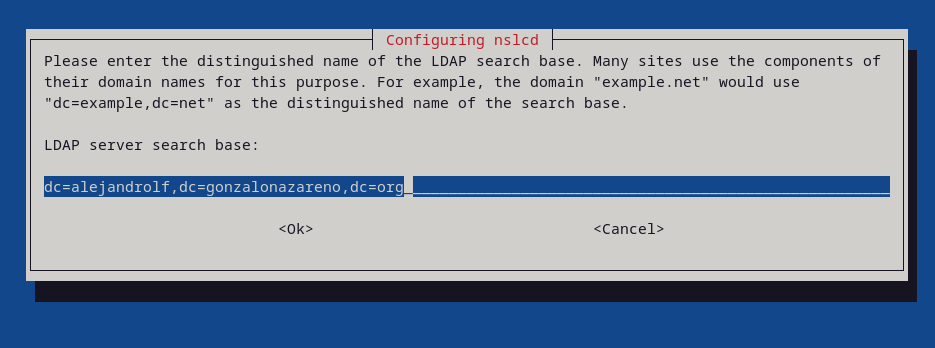
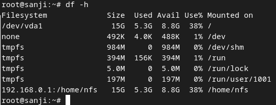
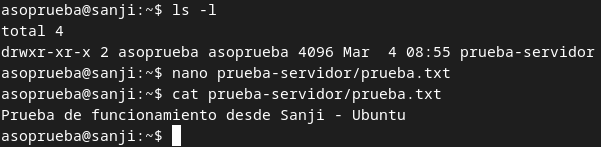

# Instalación y configuración inicial de OpenLDAP

## Enunciado

Realiza la instalación y configuración básica de OpenLDAP en una unidad de tu escenario de OpenStack, utilizando como base el nombre DNS asignado de tu proyecto. Deberás crear un usuario llamado asoprueba y configurar una máquina cliente basada en Debian y Rocky para que pueda validarse en servidor ldap configurado anteriormente con el usuario asoprueba. La ubicación del los home de los diferentes usuarios estarán ubicados en un servidor nfs.

---

## Introducción

En esta práctica, llevaremos a cabo la instalación y configuración inicial de OpenLDAP en una máquina dentro de nuestro entorno de OpenStack, utilizando el nombre DNS asignado al proyecto. OpenLDAP es un servicio de directorio ampliamente utilizado para la gestión centralizada de autenticaciones y permisos en entornos empresariales.

El objetivo principal es configurar un servidor LDAP funcional y asegurar que un cliente Debian y otro basado en Rocky puedan autenticarse en él utilizando el usuario `asoprueba`. Para garantizar la persistencia y accesibilidad de los datos de los usuarios, sus directorios personales (home) estarán alojados en un servidor **NFS**.

A lo largo de la práctica, se abordarán los siguientes puntos clave:

- Instalación y configuración de **OpenLDAP** en un servidor.
- Creación del usuario `asoprueba` dentro del servicio LDAP.
- Configuración de un cliente Debian y un cliente Rocky para autenticarse en LDAP.
- Montaje de los directorios personales de los usuarios en un servidor **NFS**.

Esta práctica permitirá comprender los fundamentos de la autenticación centralizada mediante LDAP, así como la integración con otros servicios esenciales como NFS, facilitando la administración de usuarios en entornos distribuidos.

---

## Implementación

### Servidor OpenLDAP

La máquina que actuará como **servidor OpenLDAP** será `luffy`; para averiguar el FQDN de esta, usaremos el siguiente comando:

```
alejandro@luffy:~$ hostname -f
luffy.alejandrolf.gonzalonazareno.org
```

Instalamos OpenLDAP con el siguiente comando:

```
alejandro@luffy:~$ sudo apt install slapd
Reading package lists... Done
Building dependency tree... Done
Reading state information... Done
The following additional packages will be installed:
```

Durante la instalación, se nos pedirá una contraseña para el usuario administrador de esta herramienta:


Una vez instalado, podemos comprobar que el puerto TCP 389 se encuentra abierto, ya que es por el se escucharán las peticiones:

```
sudo netstat -tlnp | egrep slap
```


Tras esto, instalaremos el paquete de herramientas que utilizará OpenLDAP:

```
alejandro@luffy:~$ sudo apt install ldap-utils
Reading package lists... Done
Building dependency tree... Done
Reading state information... Done
```

Ahora, ya podemos usar el comando `ldapsearch` con las credenciales que introducimos durante la instalación para buscar el contenido que tenemos en nuestro directorio:

```
ldapsearch -x -D "cn=admin,dc=alejandrolf,dc=gonzalonazareno,dc=org" -b "dc=alejandrolf,dc=gonzalonazareno,dc=org" -W
```


Para tener una mayor organización de los objetos que crearemos, crearemos un nuevo fichero con la siguiente información:

```
alejandro@luffy:~$ cat UnidadesOrganizativas.ldif 
dn: ou=Personas,dc=alejandrolf,dc=gonzalonazareno,dc=org
objectClass: top
objectClass: organizationalUnit
ou: Personas

dn: ou=Grupos,dc=alejandrolf,dc=gonzalonazareno,dc=org
objectClass: top
objectClass: organizationalUnit
ou: Grupos
```

Tras crear este fichero, lo inluiremos a nuestro directorio con el siguiente comando:

```
ldapadd -x -D "cn=admin,dc=alejandrolf,dc=gonzalonazareno,dc=org" -f UnidadesOrganizativas.ldif -W
```

Volvemos a usar el comando `ldapsearch` para comprobar que se han producido los cambios:

```
ldapsearch -x -b dc=alejandrolf,dc=gonzalonazareno,dc=org
```


Además, crearemos un grupo llamado `asoprueba`:

```
alejandro@luffy:~$ cat grupos.ldif 
dn: cn=asoprueba,ou=Grupos,dc=alejandrolf,dc=gonzalonazareno,dc=org
objectClass: top
objectClass: posixGroup
gidNumber: 2001
cn: asoprueba
```

Lo añadimos a nuestro directorio:

```
ldapadd -x -D 'cn=admin,dc=alejandrolf,dc=gonzalonazareno,dc=org' -W -f grupos.ldif
```

Comprobamos que se han efectuado los cambios:

```
ldapsearch -x -b dc=alejandrolf,dc=gonzalonazareno,dc=org
```


Creamos una contraseña cifrada para nuestro usuario `asoprueba` con el comando `slappasswd`:


Creamos el usuario `asoprueba`:

```
alejandro@luffy:~$ cat usuarios.ldif 
dn: uid=asoprueba,ou=Personas,dc=alejandrolf,dc=gonzalonazareno,dc=org
objectClass: top
objectClass: posixAccount
objectClass: inetOrgPerson
objectClass: person
cn: asoprueba
uid: asoprueba
uidNumber: 2001
gidNumber: 2001
homeDirectory: /home/nfs/asoprueba
loginShell: /bin/bash
userPassword: {SSHA}L/agZ+tPgjTLCdldyORqGgZjRj2tsNrw
sn: asoprueba
mail: prueba@gmail.com
givenName: asoprueba
```

Añadimos el usuario a nuestro directorio:

```
ldapadd -x -D 'cn=admin,dc=alejandrolf,dc=gonzalonazareno,dc=org' -W -f usuarios.ldif
```

Comprobamos que se ha añadido correctamente:


El usuario `asoprueba` no podrá acceder a su cuenta, ya que no tiene un directorio de inicio. Para crearlo, ejecutaremos el siguiente comando:

```
alejandro@luffy:~$ sudo mkdir /home/nfs
alejandro@luffy:~$ sudo mkdir /home/nfs/asoprueba
alejandro@luffy:~$ sudo chown 2001:2001 /home/nfs/asoprueba
```

Tras esto, modificaremos el fichero `/etc/exports` para que el usuario `asoprueba` pueda acceder a su directorio de inicio; añadiendo lo siguiente:

```
/home/nfs       *(rw,fsid=0,subtree_check)
```

Además, crearemos un directorio para pruebas posteriores:

```
mkdir prueba-servidor
```

Reiniciamos el servicio para aplicar los cambios:

```
alejandro@luffy:~$ sudo /etc/init.d/nfs-kernel-server restart
Restarting nfs-kernel-server (via systemctl): nfs-kernel-server.service.
```

En el servidor LDAP, instalamos los distintos paquetes que permiten que el sistema sea capaz de resolver nombres de usuarios (UID), grupos (GID), consultar información a un directorio LDAP, identificarse o cachear la resolución de nombres.

```
apt-get install libpam-ldapd libpam-ldap nscd libnss-ldap
```

En la instalación, se nos pedirá una dirección ip, en este caso, usaremos la local:


Inidicamos las credenciales que hemos estado usando hasta ahora:



Modificamos el fichero `/etc/nsswitch.conf` para que el sistema utilice el servicio LDAP:


Comprobamos el **uuid** del usuario `asoprueba` con el siguiente comando:

```
id asoprueba
```


Y para terminar, nos logueamos con el usuario `asoprueba`:


---

### Configuración del Cliente Ubuntu


Para configurar un cliente **Ubuntu**, utilizaremos la máquina `sanji`; primero, debemos instalar el paquete de herramientas de ldap:

```
apt install ldap-utils
```

Configuramos el fichero de configuración del cliente, añadiendo las últimas 2 líneas:

```
alejandro@sanji:~$ cat /etc/ldap/ldap.conf
#
# LDAP Defaults
#

# See ldap.conf(5) for details
# This file should be world readable but not world writable.

#BASE	dc=example,dc=com
#URI	ldap://ldap.example.com ldap://ldap-provider.example.com:666

#SIZELIMIT	12
#TIMELIMIT	15
#DEREF		never

# TLS certificates (needed for GnuTLS)
TLS_CACERT	/etc/ssl/certs/ca-certificates.crt

BASE dc=alejandrolf,dc=gonzalonazareno,dc=org
URI ldap://luffy.alejandrolf.gonzalonazareno.org
```

Tras esto, probamos que funciona correctamente con el siguiente comando:

```
ldapsearch -x -b dc=alejandrolf,dc=gonzalonazareno,dc=org
```


Además, probamos la conexión con el usuario `asoprueba`:

```
ldapwhoami -x -D "uid=asoprueba,ou=Personas,dc=alejandrolf,dc=gonzalonazareno,dc=org" -W
```


Instalaremos los siguientes paquetes necesarios:

```
sudo apt install -y libnss-ldap libpam-ldapd nscd
```

En la siguiente ventana que nos aparecerá, indicamos la dirección ya usada:


Modificamos el fichero `/etc/nsswitch.conf` para que el sistema utilice el servicio LDAP para la resolución de nombres:


Reiniciamos el servicio `nscd` para poder acceder al servidor con el comando `login`:

```
sudo service nscd restart
```

Para montar la carpeta de inicio del usuario `asoprueba`, instalaremos el paquete para usar **NFS** como cliente:

```
sudo apt install -y nfs-common
```

Activamos el servicio:

```
sudo systemctl start nfs-client.target & sudo systemctl enable nfs-client.target
```

Creamos el directorio de montaje:

```
sudo mkdir /home/nfs
sudo mkdir /home/nfs/asoprueba
sudo chown 2001:2001 /home/nfs/asoprueba
```

Cargamos el módulo de **NFS** con el siguiente módulo:

```
root@sanji:~# echo NFS | tee -a /etc/modules
NFS
```

Creamos una unidad `systemd` para montar el directorio con **NFS**:

```
root@sanji:~# cat /etc/systemd/system/home-nfs.mount
[Unit]
Description=Montaje NFS
Requires=network-online.target
After=network-online.target
[Mount]
What=192.168.0.1:/home/nfs
Where=/home/nfs
Options=_netdev,auto
Type=nfs
[Install]
WantedBy=multi-user.target
```

Comprobamos que funciona correctamente:


Usamos el comando `df -h` para comprobar que se ha montado correctamente:



Probamos a conectarnos con el usuario `asoprueba`:


Como vemos, aparece el directorio que creamos dentro del directorio de inicio del usuario; para terminar con las comprobaciones, crearemos un fichero de texto:



Nos vamos a `luffy` y comprobamos que el fichero de texto creado en `sanji` se encuentra en el directorio:


---

### Configuración del Cliente Rocky

Para configurar un cliente ***Rocky**, utilizaremos la máquina `zoro`; comenzaremos instalando el paquete `openldap-clients` para poder conectarnos al servidor LDAP y comprobar que todo funciona correctamente.

```
dnf install openldap-clients sssd sssd-ldap oddjob-mkhomedir sssd-tools -y
```

Editaremos el fichero `/etc/pam.d/system-auth` añadiendo la siguiente línea:


Creamos un fichero llamado `/etc/openldap/ldap.conf` con el siguiente contenido para que el cliente pueda conectarse al servidor LDAP:

```
BASE dc=alejandrolf,dc=gonzalonazareno,dc=org
URI ldap://luffy.alejandrolf.gonzalonazareno.org
```

Para que el usuario `asoprueba` pueda conectarse al servidor LDAP, tenemos que editar `/etc/pam.d/system-auth` y añadir la siguiente línea:

```
session required pam_mkhomedir.so skel=/etc/skel umask=0022
```


Tras esto, probamos que funciona correctamente con el siguiente comando:

```
ldapsearch -x -b dc=alejandrolf,dc=gonzalonazareno,dc=org
```


Además, probamos la conexión con el usuario `asoprueba`:

```
ldapwhoami -x -D "uid=asoprueba,ou=Personas,dc=alejandrolf,dc=gonzalonazareno,dc=org" -W
```


Para realizar el login al servidor LDAP, instalamos `sssd` y `sssd-ldap`; además, crearemos un fichero de configuración llamado `/etc/ssd/sssd.conf`:

```
[alejandro@zoro ~]$ sudo cat /etc/sssd/sssd.conf
[domain/default]
id_provider = ldap
autofs_provider = ldap
auth_provider = ldap
chpass_provider = ldap
ldap_uri = ldap://luffy.alejandrolf.gonzalonazareno.org
ldap_search_base = dc=alejandrolf,dc=gonzalonazareno,dc=org
ldap_id_use_start_tls = True
ldap_tls_cacertdir = /etc/openldap/cacerts
cache_credentials = True
ldap_tls_reqcert = allow

[sssd]
services = nss, pam, autofs
domains = default

[nss]
homedir_substring = /home/nfs
```

Le cambiamos los permisos al fichero `/etc/sssd/sssd.conf`; habilitamos el servicio y lo reiniciamos:

```
[alejandro@zoro ~]$ sudo chmod 600 /etc/sssd/sssd.conf
[alejandro@zoro ~]$ sudo systemctl restart sssd
[alejandro@zoro ~]$ sudo systemctl enable sssd
```

Creamos el directorio `/home/nfs` y lo hacemos propietario del usuario `asoprueba`:

```
[alejandro@zoro ~]$ sudo mkdir /home/nfs && sudo mkdir /home/nfs/asoprueba
[alejandro@zoro ~]$ sudo chown 2001:2001 /home/nfs/asoprueba
```

Creamos una unidad `systemd` para realizar el montaje mediante **NFS**:

```
[alejandro@zoro ~]$ cat /etc/systemd/system/home-nfs.mount
[Unit]
Description=Montaje NFS
Requires=NetworkManager.service
After=NetworkManager.service
[Mount]
What=172.16.0.1:/home/nfs
Where=/home/nfs
Options=_netdev,auto
Type=nfs
[Install]
WantedBy=multi-user.target
```

Activamos el servicio correspondiente:

```
[alejandro@zoro ~]$ sudo systemctl daemon-reload
[alejandro@zoro ~]$ sudo systemctl start home-nfs.mount
[alejandro@zoro ~]$ sudo systemctl enable home-nfs.mount
Created symlink /etc/systemd/system/multi-user.target.wants/home-nfs.mount → /etc/systemd/system/home-nfs.mount.
```

Comprobamos que el directorio se ha montado correctamente con el comando `df -h`:


Accedemos al directorio de montaje y comprobamos que, podemos ver los ficheros de prueba, creados anteriormente, desde el resto de máquinas:

