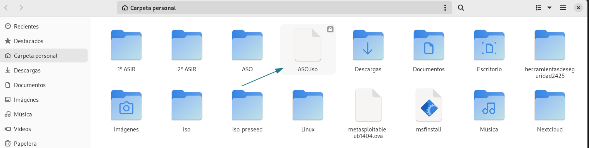
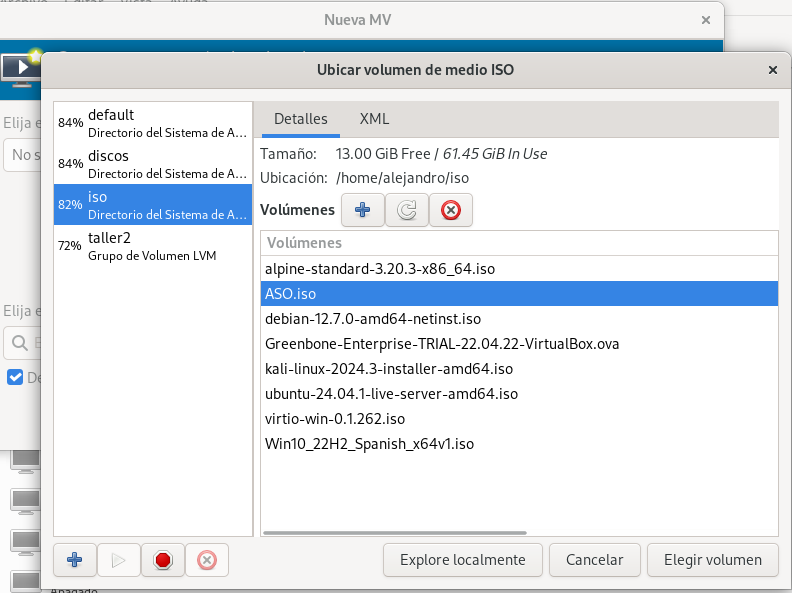
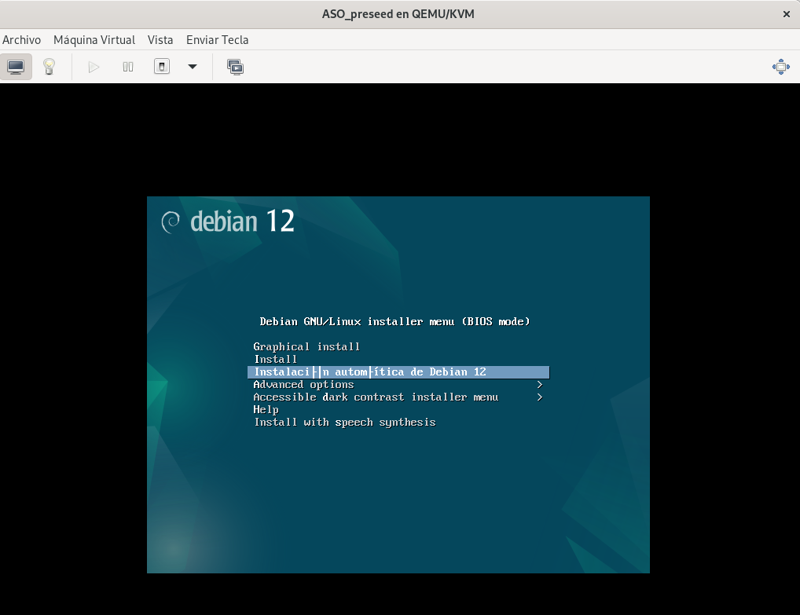
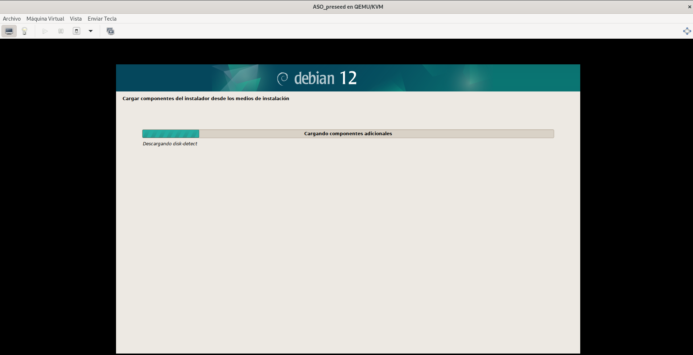
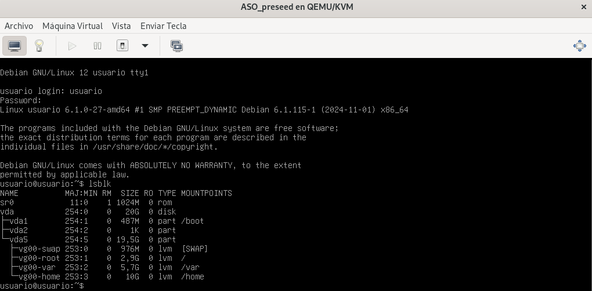

# Creación de un Sistema Automatizado de Instalación I

## Enunciado
Instalación automatizada basada en medio de almacenamiento local. Instalación basada en fichero de configuración preseed:
Creación de un sistema automatizado de instalación en distribución debian 12 bookworm.
Se deberá configurar el sistema para que se responda automáticamente a todos los items en la instalación. Las diferentes contraseñas deberán codificarse para que no aparezcan en texto plano. Se trabajará con el siguiente esquema de particiones/volúmenes. La partición efi, FAT 32, y la partición /boot, ext4, serán particiones fuera del esquema de volúmenes lógicos, el resto de volúmenes, seguirá el siguiente esquema lvm, volúmenes lógicos /, home y var. Los tamaños serán los apropiados en cada caso teniendo en cuenta el tamaño del disco empleado.

## Introducción

En esta práctica se llevará a cabo la creación y configuración de un sistema automatizado de instalación para la distribución **Debian 12 (Bookworm)**, utilizando un archivo de configuración **preseed**. Este enfoque permite automatizar el proceso de instalación, respondiendo de manera predeterminada a todas las preguntas planteadas durante la instalación del sistema operativo. De esta forma, se minimiza la intervención manual, lo que resulta ideal para despliegues masivos o entornos de prueba donde se requiera consistencia en las configuraciones.

## Objetivos

El objetivo principal de esta práctica es configurar el sistema para que cumpla con los siguientes requisitos: 

1. **Automatización completa**: Todas las configuraciones de la instalación deben resolverse mediante el archivo preseed, eliminando la necesidad de interacción manual. 
   
2. **Seguridad de contraseñas**: Las contraseñas del sistema, tanto para el usuario root como para los usuarios regulares, deben codificarse utilizando métodos de hashing seguros (SHA-512) para evitar que aparezcan en texto plano en los archivos de configuración.

3. **Esquema de particionamiento**:
   - Se configurará una tabla de particiones que contemple:
     - Una partición EFI (sistema de archivos **FAT32**).
     - Una partición **/boot** con sistema de archivos **ext4**.
   - Las particiones restantes estarán organizadas bajo un esquema de volúmenes lógicos (**LVM**) y contendrán:
     - La partición raíz **/**.
     - Una partición para **/home**.
     - Una partición para **/var**.
   - Los tamaños de las particiones se definirán según el tamaño total del disco disponible, siguiendo buenas prácticas de administración de sistemas.

## Beneficios

Esta práctica no solo pondrá en práctica habilidades técnicas relacionadas con la automatización de instalaciones, la configuración de particiones y el manejo de volúmenes lógicos, sino que también reforzará conceptos clave como la seguridad de credenciales y la gestión eficiente de recursos del sistema. 

Al finalizar, se contará con un entorno completamente funcional y seguro, desplegado de manera automatizada, que puede servir como base para otros proyectos o implementaciones similares.

## Creación del Sistema

Comenzaremos descargando el archivo iso de la página oficial de [Debian](https://www.debian.org/download.es.html).


Nos descargamos el archivo de la versión más reciente, el cuál en este caso, es la 12.7.0.


Una vez que nos hemos descargado la iso, crearemos un directorio en el que vamos a montarla para realizar los cambios convenientes:

```bash
sudo mkdir -p /mnt/iso
sudo mount -o loop Descargas/debian-12.7.0-amd64-netinst.iso /mnt/iso/
```

Si usamos el comando `ls` en ese directorio, podemos comprobar que tenemos los archivos:

```bash
[/mnt/iso]
alejandro$ ls -l
total 133
dr-xr-xr-x 1 root root  2048 ago 31 12:41 boot
dr-xr-xr-x 1 root root  2048 ago 31 12:41 css
lr-xr-xr-x 1 root root     1 ago 31 12:41 debian -> .
dr-xr-xr-x 1 root root  2048 ago 31 12:41 dists
dr-xr-xr-x 1 root root  2048 ago 31 12:41 doc
dr-xr-xr-x 1 root root  2048 ago 31 12:41 EFI
dr-xr-xr-x 1 root root  6144 ago 31 12:42 firmware
dr-xr-xr-x 1 root root  2048 ago 31 12:41 install
dr-xr-xr-x 1 root root  2048 ago 31 12:41 install.amd
dr-xr-xr-x 1 root root  6144 ago 31 12:41 isolinux
-r--r--r-- 1 root root 86209 ago 31 12:42 md5sum.txt
dr-xr-xr-x 1 root root  4096 ago 31 12:41 pics
dr-xr-xr-x 1 root root  2048 ago 31 12:42 pool
-r--r--r-- 1 root root  8806 ago 31 12:42 README.html
-r--r--r-- 1 root root   291 mar  4  2017 README.mirrors.html
-r--r--r-- 1 root root    86 mar  4  2017 README.mirrors.txt
-r--r--r-- 1 root root   543 ago 31 12:41 README.source
-r--r--r-- 1 root root  5402 ago 31 12:42 README.txt
```
Para montar el iso automatizado, no usaremos todos los ficheros, por lo que copiaremos los necesarios en otro directorio y crearemos un enlace simbólico para el resto:

```bash
mkdir iso-preseed && cd iso-preseed
cp -pr /mnt/iso/install.amd install.amd
cp -pr /mnt/iso/dists dists
cp -pr /mnt/iso/pool pool
cp -pr /mnt/iso/.disk .disk
cp -pr /mnt/iso/isolinux isolinux
ln -s . debian
```

Comprobamos los ficheros de nuevo:

```bash
[~/iso-preseed] (master)
alejandro$ ls -l
total 4
lrwxrwxrwx 1 alejandro alejandro    1 nov 21 16:31 debian -> .
dr-xr-xr-x 3 alejandro alejandro   36 ago 31 12:41 dists
dr-xr-xr-x 4 alejandro alejandro   60 ago 31 12:41 install.amd
dr-xr-xr-x 2 alejandro alejandro 4096 ago 31 12:41 isolinux
dr-xr-xr-x 5 alejandro alejandro   58 ago 31 12:42 pool
```

Dentro de este directorio, crearemos otro en el que alojaremos nuestro archivo `preseed.cfg`:

```bash
[~/iso-preseed] (master)
alejandro$ sudo mkdir archivo

[~/iso-preseed] (master)
alejandro$ cd archivo/

[~/iso-preseed/archivo] (master)
alejandro$ sudo nano preseed.cfg
```

Nuestro archivo `preseed.cfg` tendrá la siguiente estructura:

```bash
##############################################################################

#   Instalación automatizada de Debian 12

##############################################################################


#Configuración de idioma

d-i debian-installer/locale string es_ES
d-i debian-installer/language string spanish
d-i debian-installer/country string Spain
d-i debian-installer/locale string es_ES.UTF-8
d-i localechooser/supported-locales es_ES.UTF-8

#Configuración de teclado

d-i keyboard-configuration/toggle select No toggling
d-i keymap select es
d-i console-setup/ask_detect boolean true
d-i keyboard-configuration/modelcode string pc105
d-i keyboard-configuration/layoutcode string es
d-i keyboard-configuration/variantcode string qwerty

#Configuración de interfaz

d-i netcfg/choose_interface select auto

# Creación del usuario y contraseña de root
d-i passwd/root-password-crypted password $6$DYwY058BOlS6TU0B$hSBSBz01JNffBcYA05T4ki4W9DwScMoBoQXFVxYTE3sPBF1XB.VNIMeFm1BJrzzhNGokwsIrjPstpmkQPFOqC/
d-i passwd/root-password-again-crypted password $6$DYwY058BOlS6TU0B$hSBSBz01JNffBcYA05T4ki4W9DwScMoBoQXFVxYTE3sPBF1XB.VNIMeFm1BJrzzhNGokwsIrjPstpmkQPFOqC/

# Creación del usuario normal
d-i passwd/user-fullname string usuario
d-i passwd/username string usuario
d-i passwd/user-password-crypted password $6$DYwY058BOlS6TU0B$hSBSBz01JNffBcYA05T4ki4W9DwScMoBoQXFVxYTE3sPBF1XB.VNIMeFm1BJrzzhNGokwsIrjPstpmkQPFOqC/

#Configuración del host y selección de dominio

d-i netcfg/get_hostname string usuario
d-i netcfg/get_domain string
d-i hw-detect/load_firmware boolean false

#Zona horaria

d-i clock-setup/utc boolean true
d-i time/zone string ES/Madrid
d-i clock-setup/ntp boolean true

#Configuración del repositorio de Debian

d-i mirror/country string manual
d-i mirror/http/hostname string ftp.es.debian.org
d-i mirror/http/directory string /debian
d-i mirror/http/proxy string

#Configuración de la negativa a la participación en la encuesta

popularity-contest popularity-contest/participate boolean false

# Configuración de particionamiento
d-i partman-auto/disk string /dev/vda
d-i partman-lvm/device_remove_lvm boolean true
d-i partman-auto/method string lvm
d-i partman-lvm/confirm boolean true
d-i partman-auto/choose_recipe select mypartitioning
d-i partman-auto-lvm/new_vg_name string vg00
d-i partman-auto-lvm/guided_size string max
d-i partman-lvm/confirm_nooverwrite boolean true

# Esquema de particionamiento personalizado
d-i partman-auto/expert_recipe string \
      mypartitioning :: \
              512 1 512 xfs \
                      $primary{ } $bootable{ } \
                      method{ format } format{ } \
                      use_filesystem{ } filesystem{ xfs } \
                      mountpoint{ /boot } \
              . \
              1024 1 1024 linux-swap \
                      $defaultignore{ } \
                      $lvmok{ } \
                      lv_name{ swap } \
                      in_vg { vg00 } \
                      method{ swap } format{ } \
              . \
              3072 1 3072 xfs \
                      $defaultignore{ } \
                      $lvmok{ } \
                      lv_name{ root } \
                      in_vg { vg00 } \
                      method{ format } format{ } \
                      use_filesystem{ } filesystem{ xfs } \
                      mountpoint{ / } \
              . \
              6144 1 6144 xfs \
                      $defaultignore{ } \
                      $lvmok{ } \
                      lv_name{ var } \
                      in_vg { vg00 } \
                      method{ format } format{ } \
                      use_filesystem{ } filesystem{ xfs } \
                      mountpoint{ /var } \
              . \
              8192 1 1000000000 xfs \
                      $defaultignore{ } \
                      $lvmok{ } \
                      lv_name{ home } \
                      in_vg { vg00 } \
                      method{ format } format{ } \
                      use_filesystem{ } filesystem{ xfs } \
                      mountpoint{ /home } \
              .

# Confirmación de escritura de nueva etiqueta de partición
d-i partman-partitioning/confirm_write_new_label boolean true
d-i partman/choose_partition select finish
d-i partman/confirm boolean true
d-i partman/confirm_nooverwrite boolean true

#Análisis de medios adicionales

d-i apt-setup/cdrom/set-first boolean false
d-i apt-setup/cdrom/set-next boolean false
d-i apt-setup/cdrom/set-failed boolean false

#Instalación del grub

d-i grub-installer/only_debian boolean true
d-i grub-installer/with_other_os boolean false
d-i grub-installer/bootdev string default

#Selección de paquetes

tasksel tasksel/first multiselect standard, ssh-server

#Finalización de la instalación

d-i finish-install/reboot_in_progress note
```

Cabe mencionar que debemos de codificar las contraseñas para que no aparezcan en texto plano, para ello usaremos el comando```mkpasswd --method=SHA-512``` más la contraseña que queramos usar; como ejemplo, podemos usar:

```bash
mkpasswd --method=SHA-512 usuario
```
Este comando nos dará un `hash` que corresponderá a la contraseña que queramos usar.

El siguiente paso que realizaremos será de editar el archivo `txt.cfg` ubicado dentro del directorio `/isolinux` de la siguiente forma:

```bash
default install
label install
        menu label ^Install
        kernel /install.amd/vmlinuz
        append vga=788 initrd=/install.amd/initrd.gz -- quiet
label unattended-gnome
 menu label ^Instalación automática de Debian 12
 kernel /install.amd/gtk/vmlinuz
 append vga=788 initrd=/install.amd/gtk/initrd.gz preseed/file=/cdrom/archivo/preseed.cfg 
locale=es_ES console-setup/ask_detect=false keyboard-configuration/xkb-keymap=es --
```

Al realizar cambios en el directorio `/isolinux`, debemos generar la verificación de éste, que irá alojada en el CD, para ello ejecutamos el siguiente comando:

```bash
md5sum `find ! -name "md5sum.txt" ! -path "./isolinux/*" -follow -type f` > md5sum.txt
 ```

Por último, generaremos la iso desde el directorio inicial de nuestro sistema ejecutando el siguiente comando:

 ```bash
 sudo genisoimage -o ASO.iso -l -r -J -no-emul-boot -boot-load-size 4 -boot-info-table -b isolinux/isolinux.bin -c isolinux/boot.cat iso-preseed
 ```

Si nos dirigimos a nuestros archivos, podremos ver la nueva iso:



Tan sólo nos quedaría crear una nueva máquina virtual con esta nueva iso:



Escogemos la opción de instalación que hemos creado, en este caso la llamada **Instalación automática de Debian 12**,:



Comprobamos que toda la instalación se realiza de forma automática:



Una vez realizada la instalación, comprobamos que entramos con la contraseña que codificamos anteriormente y que las particiones se han creado correctamente con el comando `lsblk`:

