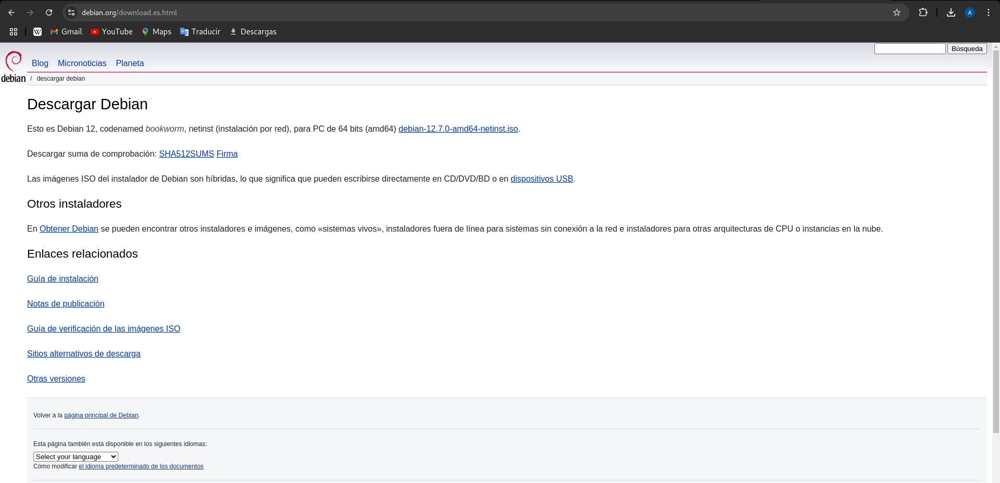
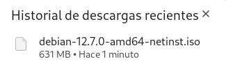

# Creación de un Sistema Automatizado de Instalación I

## Enunciado
Instalación automatizada basada en medio de almacenamiento local. Instalación basada en fichero de configuración preseed:
Creación de un sistema automatizado de instalación en distribución debian 12 bookworm.
Se deberá configurar el sistema para que se responda automáticamente a todos los items en la instalación. Las diferentes contraseñas deberán codificarse para que no aparezcan en texto plano. Se trabajará con el siguiente esquema de particiones/volúmenes. La partición efi, FAT 32, y la partición /boot, ext4, serán particiones fuera del esquema de volúmenes lógicos, el resto de volúmenes, seguirá el siguiente esquema lvm, volúmenes lógicos /, home y var. Los tamaños serán los apropiados en cada caso teniendo en cuenta el tamaño del disco empleado.

## Introducción

En esta práctica se llevará a cabo la creación y configuración de un sistema automatizado de instalación para la distribución **Debian 12 (Bookworm)**, utilizando un archivo de configuración **preseed**. Este enfoque permite automatizar el proceso de instalación, respondiendo de manera predeterminada a todas las preguntas planteadas durante la instalación del sistema operativo. De esta forma, se minimiza la intervención manual, lo que resulta ideal para despliegues masivos o entornos de prueba donde se requiera consistencia en las configuraciones.

## Objetivos

El objetivo principal de esta práctica es configurar el sistema para que cumpla con los siguientes requisitos: 

1. **Automatización completa**: Todas las configuraciones de la instalación deben resolverse mediante el archivo preseed, eliminando la necesidad de interacción manual. 
   
2. **Seguridad de contraseñas**: Las contraseñas del sistema, tanto para el usuario root como para los usuarios regulares, deben codificarse utilizando métodos de hashing seguros (SHA-512) para evitar que aparezcan en texto plano en los archivos de configuración.

3. **Esquema de particionamiento**:
   - Se configurará una tabla de particiones que contemple:
     - Una partición EFI (sistema de archivos **FAT32**).
     - Una partición **/boot** con sistema de archivos **ext4**.
   - Las particiones restantes estarán organizadas bajo un esquema de volúmenes lógicos (**LVM**) y contendrán:
     - La partición raíz **/**.
     - Una partición para **/home**.
     - Una partición para **/var**.
   - Los tamaños de las particiones se definirán según el tamaño total del disco disponible, siguiendo buenas prácticas de administración de sistemas.

## Beneficios

Esta práctica no solo pondrá en práctica habilidades técnicas relacionadas con la automatización de instalaciones, la configuración de particiones y el manejo de volúmenes lógicos, sino que también reforzará conceptos clave como la seguridad de credenciales y la gestión eficiente de recursos del sistema. 

Al finalizar, se contará con un entorno completamente funcional y seguro, desplegado de manera automatizada, que puede servir como base para otros proyectos o implementaciones similares.

## Creación del Sistema

Comenzaremos descargando el archivo iso de la página oficial de [Debian](https://www.debian.org/download.es.html).



Nos descargamos el archivo de la versión más reciente, el cuál en este caso, es la 12.7.0.



Una vez que nos hemos descargado la iso, crearemos un directorio en el que vamos a montarla para realizar los cambios convenientes:

```bash
sudo mkdir -p /mnt/iso
sudo mount -o loop Descargas/debian-12.7.0-amd64-netinst.iso /mnt/iso/
```
Si usamos el comando `ls` en ese directorio, podemos comprobar que tenemos los archivos:
```
alejandro$ ls
boot  debian  doc  firmware  install.amd  md5sum.txt  pool         README.mirrors.html  README.source
css   dists   EFI  install   isolinux     pics        README.html  README.mirrors.txt   README.txt
```