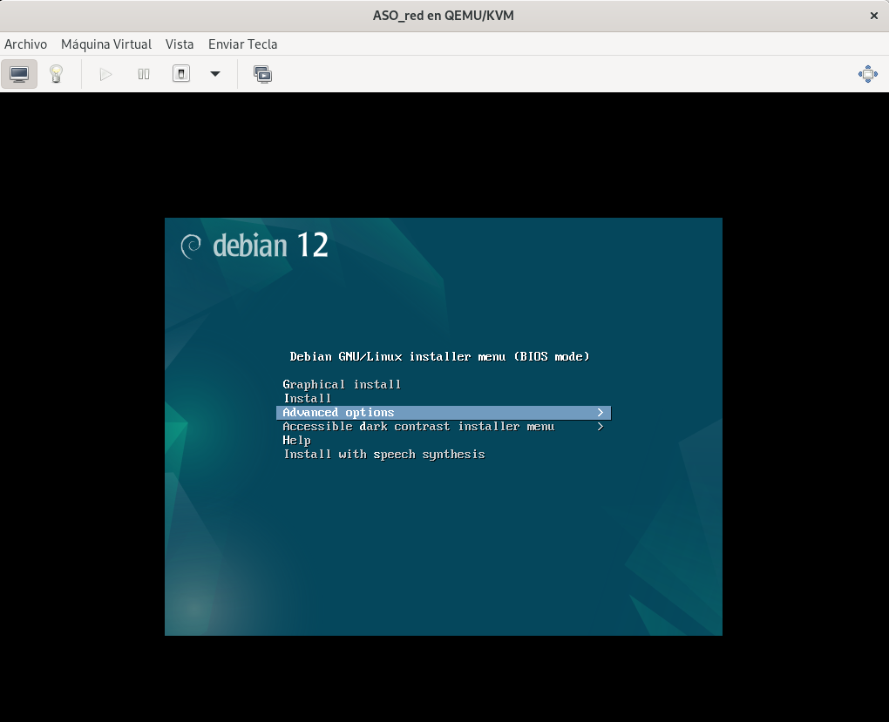
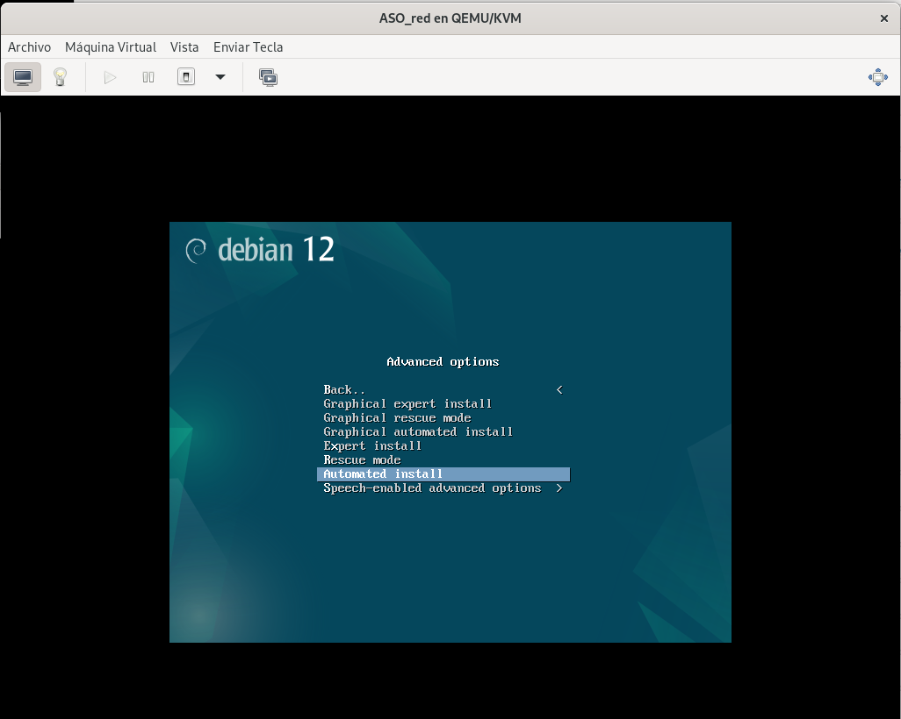
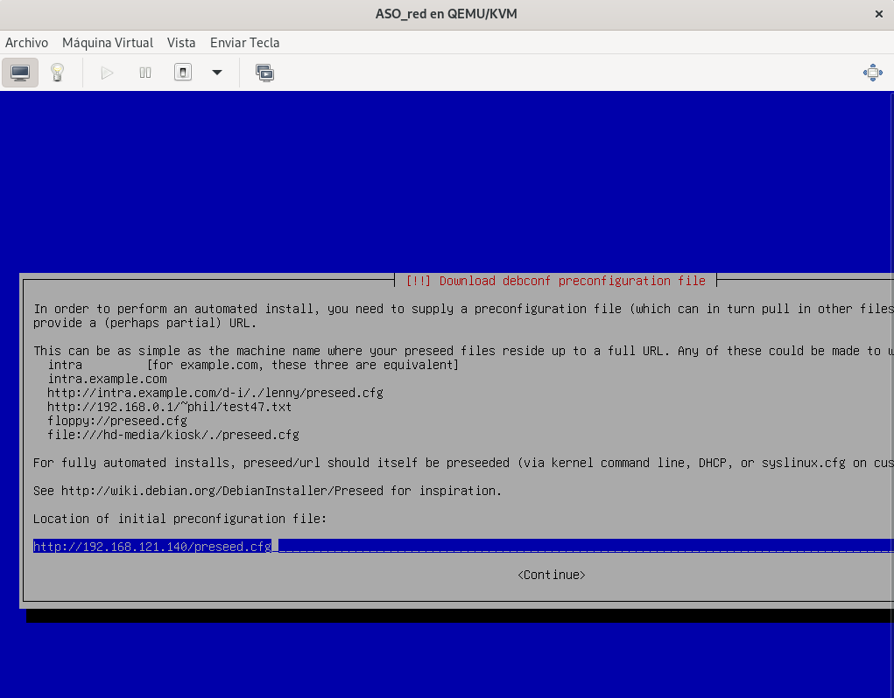
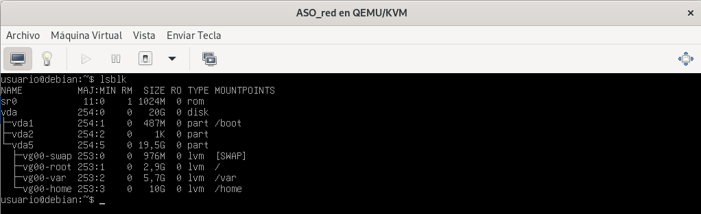
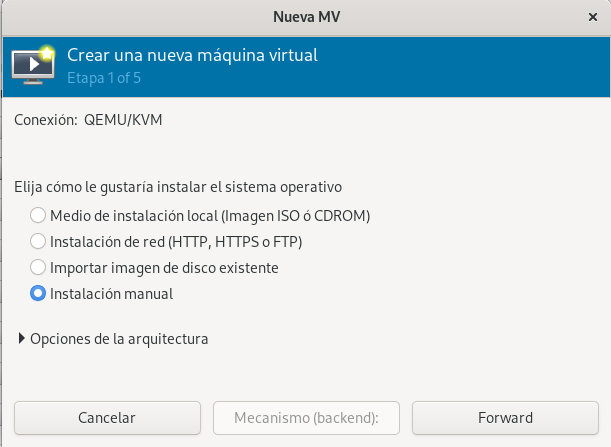
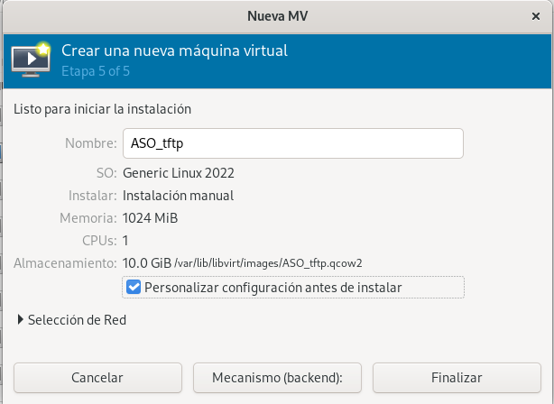
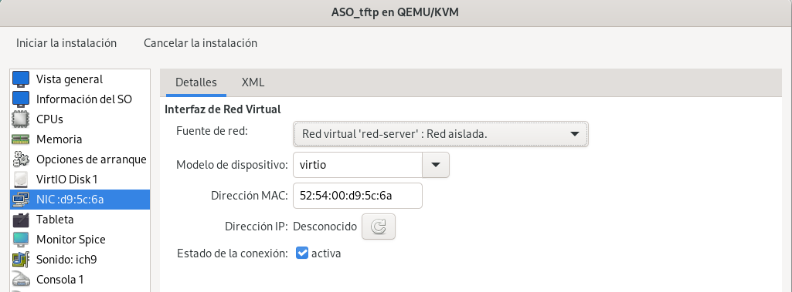
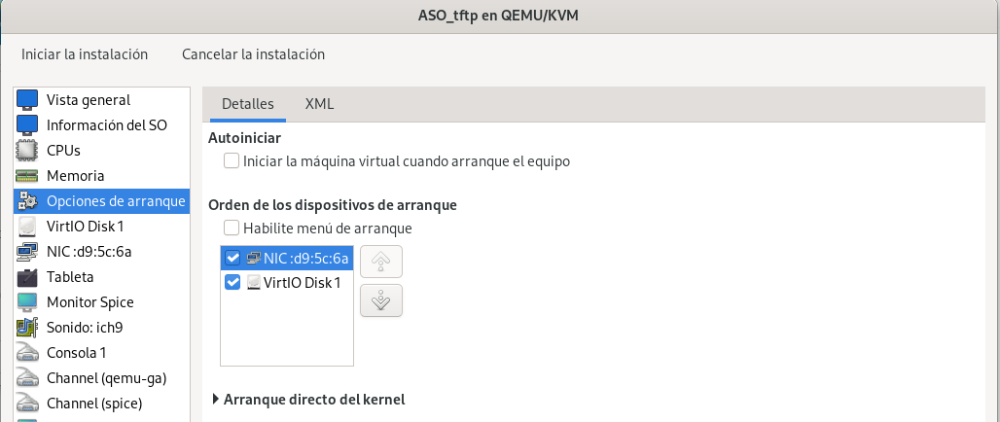
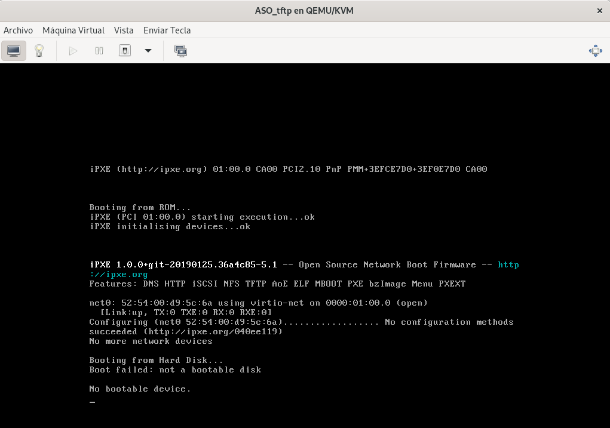

# Creación de un Sistema Automatizado de Instalación II

## Enunciado

Tomando como referencia, lo implementado en Creación de un sistema automatizado de instalación I:
- Instalación automatizada con carga de preseed desde red.
- Implementa la realización de instalación basada en preseed/PXE/TFTP

## Introducción: Instalación Automatizada de Debian 12 con Preseed

Esta práctica está dividida en dos partes que abordan diferentes métodos para implementar un sistema de instalación automatizada de **Debian 12 (Bookworm)** mediante el uso del archivo **preseed**. Ambos enfoques buscan optimizar la instalación en múltiples sistemas, eliminando la intervención manual y asegurando un despliegue eficiente y estándar.

### Objetivos Generales

1. Automatizar la instalación de Debian 12 utilizando dos enfoques complementarios:
   - Carga del archivo preseed desde un servidor HTTP (Nginx).
   - Arranque remoto e instalación mediante PXE y TFTP.
2. Implementar un esquema de particionamiento eficiente con particiones estándar y volúmenes lógicos.
3. Configurar servidores (Nginx, PXE y TFTP) para soportar los diferentes flujos de instalación.
4. Garantizar la seguridad de las configuraciones mediante el uso de contraseñas codificadas.

Esta práctica proporciona una visión completa de las herramientas y técnicas necesarias para gestionar despliegues masivos en entornos profesionales o educativos, aprovechando métodos modernos de automatización y distribución de sistemas operativos.

## Primera Parte: Instalación Automatizada con Preseed y Servidor Nginx

En la primera parte, se configura un sistema automatizado de instalación utilizando un archivo preseed servido desde un **servidor Nginx**. Este método emplea una solución simple pero efectiva, en la que el archivo preseed se distribuye a través de un servidor HTTP local. Este archivo define todas las respuestas necesarias para la instalación, incluyendo configuraciones de red, particionamiento, y la creación de usuarios con contraseñas codificadas.

El esquema de particionamiento incluye particiones estándar para EFI (FAT32) y `/boot` (ext4), mientras que el resto del disco utiliza volúmenes lógicos (LVM) para las particiones `/`, `/home` y `/var`. Este enfoque permite realizar instalaciones automatizadas rápidas en sistemas individuales.

Para comenzar, crearemos una máquina virtual con **vagrant**, para la cuál usaremos un `vagrantfile`:

```
Vagrant.configure("2") do |config|
  config.vm.box = "debian/bookworm64"
  config.vm.hostname = "servidorDHCP"
  config.vm.network :private_network,
    :libvirt__network_name => "red-server",
    :libvirt__dhcp_enabled => false,
    :ip => "172.22.2.5",
    :libvirt__forward_mode => "none"
  end
```

Como vamos a realizar una instalación por red, necesitamos un servidor web en nuestra nueva máquina, para ello instalremos **Nginx** con el siguiente comando:

```
sudo apt install nginx -y
```

Comprobamos que el servidor funciona correctamente:

```
vagrant@servidorDHCP:~$ sudo systemctl status nginx
● nginx.service - A high performance web server and a reverse proxy server
     Loaded: loaded (/lib/systemd/system/nginx.service; enabled; preset: enabled)
     Active: active (running) since Sun 2024-11-24 18:29:06 UTC; 2min 18s ago
       Docs: man:nginx(8)
    Process: 423 ExecStartPre=/usr/sbin/nginx -t -q -g daemon on; master_process on; (code=exited, status=0/SUCCESS)
    Process: 426 ExecStart=/usr/sbin/nginx -g daemon on; master_process on; (code=exited, status=0/SUCCESS)
   Main PID: 429 (nginx)
      Tasks: 2 (limit: 496)
     Memory: 3.5M
        CPU: 10ms
     CGroup: /system.slice/nginx.service
             ├─429 "nginx: master process /usr/sbin/nginx -g daemon on; master_process on;"
             └─431 "nginx: worker process"

Nov 24 18:29:06 servidorDHCP systemd[1]: Starting nginx.service - A high performance web server and a reverse proxy server...
Nov 24 18:29:06 servidorDHCP systemd[1]: Started nginx.service - A high performance web server and a reverse proxy server.
```

Nos transferiremos nuestro fichero `preseed.cfg`, el cuál creamos en la práctica anterior, a nuestra máquina que contiene el servidor web; para ello usamos el comando `scp`:

```
scp /home/alejandro/preseed.cfg vagrant@192.168.121.140:/home/vagrant/
```

Comprobamos que tenemos nuestro archivo en nuestra máquina correspondiente:

```
vagrant@servidorDHCP:~$ ls
preseed.cfg
```

Lo copiamos en el `Document Root` que trae por defecto **Nginx**, para que pueda verse a través de la web:

```
sudo cp preseed.cfg /var/www/html/
```

Comprobamos que tenemos el archivo en el directorio adecuado:

```
vagrant@servidorDHCP:/var/www/html$ ls
index.nginx-debian.html  preseed.cfg
```

Tras esto, no iremos a nuestro navegador web y pondremos la dirección ip de nuestra máquina para comprobar que todo funciona correctamente:


Tras esto, lo único que tenemos que hacer es crear una nueva máquina virtual que se encuentre en la **misma red** que la anterior, a partir de una iso sin modificar.

Una vez arrancada la máquina debemos escoger la opción **"Advanced options"** en el menú de instalaciones:



Tras esto, nos aparecerá otro menú, en este caso escogeremos la opción **"Automated install"**:



La instalación comenzará y, al llegar a la siguiente ventana, debemos indicar la dirección ip del servidor web dónde está alojado nuestro archivo:



Una vez terminada la instalación, comprobaremos que se han realizado las configuraciones indicadas de forma correcta, para ello usaremos el comando `lsblk` para revisar el partcionado del disco:



## Segunda Parte: Instalación Automatizada con Preseed, PXE y TFTP

La segunda parte amplía la automatización a un entorno de red más avanzado, configurando un sistema de arranque remoto mediante **PXE (Preboot Execution Environment)** y **TFTP (Trivial File Transfer Protocol)**. Este método elimina la necesidad de dispositivos de arranque locales, permitiendo que las máquinas cliente arranquen desde la red. El archivo preseed se carga automáticamente desde el servidor TFTP para completar la instalación sin intervención manual.

En este escenario, los sistemas cliente obtienen los archivos de arranque necesarios (como el kernel y el initrd) desde el servidor PXE/TFTP y aplican la configuración automatizada definida en el archivo preseed.

Para comenzar esta parte, volvemos a utilizar la máquina que creamos con **Vagrant**, pero esta vez, actuará como servidor **DHCP**; instalaremos los paquetes necesarios para ello:

```
sudo apt install isc-dhcp-server -y
```

Debemos configurar el fichero`/etc/dhcp/dhcpd.conf` para crear un nuevo rango de direcciones:

```
subnet 192.168.121.0 netmask 255.255.255.0 {
    range 192.168.121.2 192.168.121.100;
    option routers 192.168.121.1;
    option domain-name-servers 8.8.8.8, 8.8.4.4;
    option domain-name "example.com";
}
```

Configuraremos también el fichero `/etc/default/isc-dhcp-server`, buscando la línea `INTERFACESv4=""` en la que debemos indicar la interfaz de red que va a utilizar el servidor.

Tras realizar estos cambios, reiniciaremos el servicio con el comando `sudo systemctl restart isc-dhcp-server`; tras esto, comprobaremos que el servidor funciona correctamente: 

```
vagrant@servidorDHCP:~$ sudo systemctl status isc-dhcp-server
● isc-dhcp-server.service - LSB: DHCP server
     Loaded: loaded (/etc/init.d/isc-dhcp-server; generated)
     Active: active (running) since Sun 2024-11-24 19:13:40 UTC; 46s ago
       Docs: man:systemd-sysv-generator(8)
    Process: 1156 ExecStart=/etc/init.d/isc-dhcp-server start (code=exited, status=0/SUCCESS)
      Tasks: 1 (limit: 496)
     Memory: 4.4M
        CPU: 32ms
     CGroup: /system.slice/isc-dhcp-server.service
             └─1168 /usr/sbin/dhcpd -4 -q -cf /etc/dhcp/dhcpd.conf eth0

Nov 24 19:13:38 servidorDHCP systemd[1]: Starting isc-dhcp-server.service - LSB: DHCP server...
Nov 24 19:13:38 servidorDHCP isc-dhcp-server[1156]: Launching IPv4 server only.
Nov 24 19:13:38 servidorDHCP dhcpd[1168]: Wrote 0 leases to leases file.
Nov 24 19:13:38 servidorDHCP dhcpd[1168]: Server starting service.
Nov 24 19:13:40 servidorDHCP isc-dhcp-server[1156]: Starting ISC DHCPv4 server: dhcpd.
Nov 24 19:13:40 servidorDHCP systemd[1]: Started isc-dhcp-server.service - LSB: DHCP server.
```

Tras tener listo el servidor DHCP, instalaremos el servidor **TFTP**, para ello usamos el siguiente comando:

```
sudo apt install tftpd-hpa -y
```

Comprobamos su estado:

```
vagrant@servidorDHCP:~$ sudo systemctl status tftpd-hpa.service 
● tftpd-hpa.service - LSB: HPA's tftp server
     Loaded: loaded (/etc/init.d/tftpd-hpa; generated)
     Active: active (running) since Sun 2024-11-24 19:34:23 UTC; 12s ago
       Docs: man:systemd-sysv-generator(8)
    Process: 1828 ExecStart=/etc/init.d/tftpd-hpa start (code=exited, status=0/SUCCESS)
      Tasks: 1 (limit: 496)
     Memory: 916.0K
        CPU: 13ms
     CGroup: /system.slice/tftpd-hpa.service
             └─1836 /usr/sbin/in.tftpd --listen --user tftp --address :69 --secure /srv/tftp

Nov 24 19:34:23 servidorDHCP systemd[1]: Starting tftpd-hpa.service - LSB: HPA's tftp server...
Nov 24 19:34:23 servidorDHCP tftpd-hpa[1828]: Starting HPA's tftpd: in.tftpd.
Nov 24 19:34:23 servidorDHCP systemd[1]: Started tftpd-hpa.service - LSB: HPA's tftp server.
```

Nos dirigiremos al directorio `/srv/tftp/`, el cuál se crea en la instalación por defecto; en este directorio descargaremos la imagen iso de Debian 12 con el comando `wget`:

```
vagrant@servidorDHCP:/srv/tftp$ sudo wget https://deb.debian.org/debian/dists/bookworm/main/installer-amd64/current/images/netboot/netboot.tar.gz
--2024-11-24 19:19:52--  https://deb.debian.org/debian/dists/bookworm/main/installer-amd64/current/images/netboot/netboot.tar.gz
Resolving deb.debian.org (deb.debian.org)... 151.101.134.132, 2a04:4e42:1f::644
Connecting to deb.debian.org (deb.debian.org)|151.101.134.132|:443... connected.
HTTP request sent, awaiting response... 200 OK
Length: 51456576 (49M) [application/x-gzip]
Saving to: ‘netboot.tar.gz’

netboot.tar.gz            100%[=====================================>]  49.07M  21.5MB/s    in 2.3s    

2024-11-24 19:19:55 (21.5 MB/s) - ‘netboot.tar.gz’ saved [51456576/51456576]
```

Descomprimimos lo descargado con el comando `sudo tar -xvf netboot.tar.gz` y comprobamos los archivos con el comando `ls`:

```
vagrant@servidorDHCP:/srv/tftp$ ls -l
total 50264
drwxr-xr-x 3 root root     4096 Nov  3 22:30 debian-installer
lrwxrwxrwx 1 root root       47 Nov  3 22:30 ldlinux.c32 -> debian-installer/amd64/boot-screens/ldlinux.c32
-rw-r--r-- 1 root root 51456576 Nov  3 22:30 netboot.tar.gz
lrwxrwxrwx 1 root root       33 Nov  3 22:30 pxelinux.0 -> debian-installer/amd64/pxelinux.0
lrwxrwxrwx 1 root root       35 Nov  3 22:30 pxelinux.cfg -> debian-installer/amd64/pxelinux.cfg
lrwxrwxrwx 1 root root       47 Nov  3 22:30 splash.png -> debian-installer/amd64/boot-screens//splash.png
-rw-r--r-- 1 root root       65 Nov  3 22:30 version.info
```

Por último, crearemos una nueva máquina virtual, en la que debemos indicar que realizaremos una instalación manual:



Personalizamos la máquina antes de llevar a cabo la instalación:



Conectamos la máquina a la misma red que nuestra máquina que actuaá como servidor:



Indicamos que se arranque por red en las opciones de arranque de la máquina:



Este sería el último paso, ya que se debería encontrar lo alojado en el servidor TFTP, pero me da un error que no he sido capaz de solucionar:



Tras buscar información, parece que el problema tiene que ver con la tarjeta gráfica de mi dispositivo.